# Manual de instalação do Git

> git the Fork on! talk by [@izabelacborges](https://github.com/izabelacborges)

Partindo do pré-suposto que todo mundo aqui tá usando um sistema operacional tipo UNIX, seja alguma distribuição do linux ou macOS (e que quem infelizmente ainda estiver usando Windows tenha o [WSL2](https://ubunlog.com/pt/wsl-como-instalar-y-usar-el-susbistema-ubuntu-en-windows-10/) instalado), vamos à alguns recursos necessários antes de começar esse workshop...

PS.: se você decidir usar o Windows puro pra esse workshop, te desejo sorte, mas eu talvez não consiga te ajudar a resolver pepinos que eventualmente ocorram na instalação de algumas coisas 🤷

## Comandos de terminal

Espero que vocês estejam pelo menos um pouco familiarizados com comandos de terminal. E caso não estejam, tem uma colinha fácil [aqui](https://www.hostinger.com.br/tutoriais/comandos-linux).

Inclusive, uma boa testar esses no seu próprio terminal pra ter uma ideia de como eles funcionam na prática.

PS.2: Se você estiver usando o Windows puro, a Microsoft tem uma [lista enorme aqui](https://docs.microsoft.com/pt-br/windows-server/administration/windows-commands/windows-commands).

## Instalando o git

### Instalando o git no linux (Ubuntu/Debian/WSL2)

1. Abra o terminal e execute os seguintes comandos:

```bash
sudo apt-get update
sudo apt-get install git
```

1. Verifique se a instalação ocorreu com sucesso:

```bash
git --version
```

1. Configure o git para o seu usuário:

```bash
git config --global user.name "Nome Sobrenome"
git config --global user.email "exemplo@seuemail.com"
git config --global color.ui true
git config --global core.editor "vim"
```

Nesse caso o vim foi usado como o editor padrão para edição de mensagens de prompt do git. Usamos o vim porque ele abre no próprio terminal e é geralmente mais fácil e rápido, mas você pode trocar isso depois por algum dos outros existentes na tabela presente [nesta página](https://www.atlassian.com/br/git/tutorials/setting-up-a-repository/git-config).

### Instalando o git no linux (Fedora)

1. Abra o terminal e execute os seguintes comandos:

```bash
sudo dnf check-update
sudo dnf install git
```

1. Verifique se a instalação ocorreu com sucesso:

```bash
git --version
```

1. Configure o git para o seu usuário:

```bash
git config --global user.name "Nome Sobrenome"
git config --global user.email "exemplo@seuemail.com"
git config --global color.ui true
git config --global core.editor "vim"
```

Nesse caso o vim foi usado como o editor padrão para edição de mensagens de prompt do git. Usamos o vim porque ele abre no próprio terminal e é geralmente mais fácil e rápido, mas você pode trocar isso depois por algum dos outros existentes na tabela presente [nesta página](https://www.atlassian.com/br/git/tutorials/setting-up-a-repository/git-config).

### Instalando o git no linux (CentOS/RHEL)

1. Abra o terminal e execute os seguintes comandos:

```bash
sudo yum update
sudo yum install git
```

1. Verifique se a instalação ocorreu com sucesso:

```bash
git --version
```

1. Configure o git para o seu usuário:

```bash
git config --global user.name "Nome Sobrenome"
git config --global user.email "exemplo@seuemail.com"
git config --global color.ui true
git config --global core.editor "vim"
```

Nesse caso o vim foi usado como o editor padrão para edição de mensagens de prompt do git. Usamos o vim porque ele abre no próprio terminal e é geralmente mais fácil e rápido, mas você pode trocar isso depois por algum dos outros existentes na tabela presente [nesta página](https://www.atlassian.com/br/git/tutorials/setting-up-a-repository/git-config).

### Instalando o git no macOS X

1. Abra o terminal e instale o Homebrew (caso já tenha ele instalado, só seguir pro próximo comando!):

```bash
/bin/bash -c "$(curl -fsSL https://raw.githubusercontent.com/Homebrew/install/HEAD/install.sh)"
```

1. Execute os seguintes comandos:

```bash
brew update
brew install git
```

1. Verifique se a instalação ocorreu com sucesso:

```bash
git --version
```

1. Configure o git para o seu usuário:

```bash
git config --global user.name "Nome Sobrenome"
git config --global user.email "exemplo@seuemail.com"
git config --global color.ui true
git config --global core.editor "vim"
```

Nesse caso o vim foi usado como o editor padrão para edição de mensagens de prompt do git. Usamos o vim porque ele abre no próprio terminal e é geralmente mais fácil e rápido, mas você pode trocar isso depois por algum dos outros existentes na tabela presente [nesta página](https://www.atlassian.com/br/git/tutorials/setting-up-a-repository/git-config).

### Instalando o git no Windows

1. Primeiro, acesse o site oficial e faça download do instalador do git.

    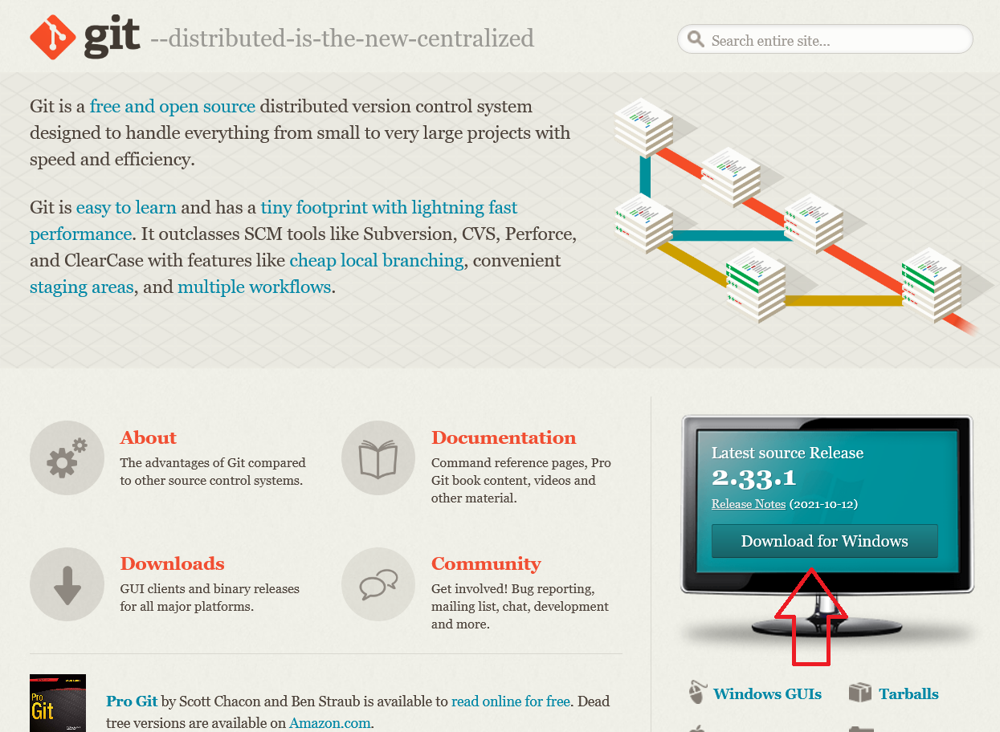

2. Após o download, execute o instalador.

    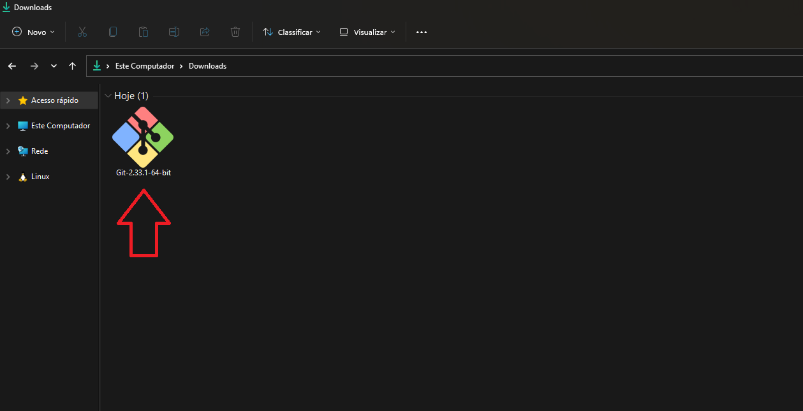

3. O instalador irá apresentar uma tela com os termos da licença de utilização do Git.

    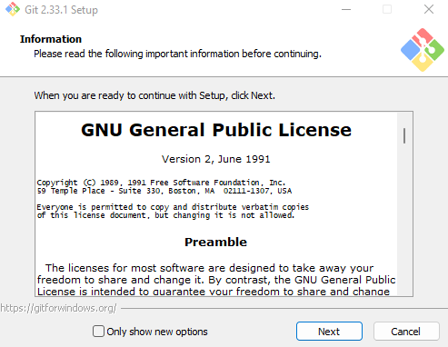

4. Em seguida, você poderá definir o local de instalação.

    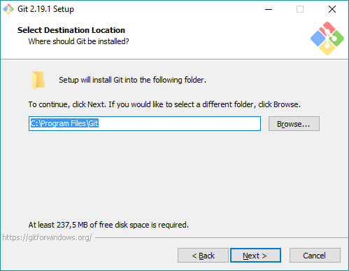

5. O instalador então possibilita a instalação de alguns componentes. Marque o que você deseja que seja instalado e desmarque o você prefere que não seja instalado.

    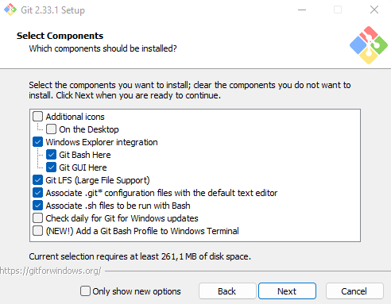

6. Em seguida, selecione um editor de texto padrão para ser utilizado pelo Git para editar conflitos.

    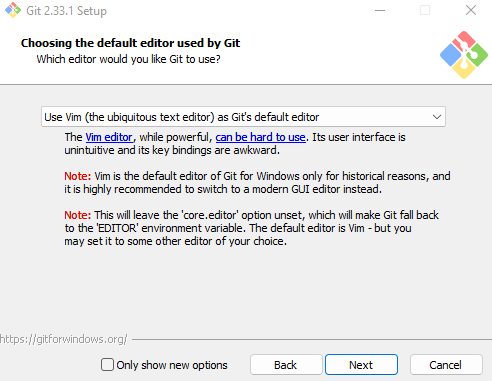

7. O instalador nos possibilita editar o nome do branch inicial. No momento, o Git nomeia por padrão o branch inicial como `master`. Escolha entre alterar ou manter o nome padrão e clique em Next.

    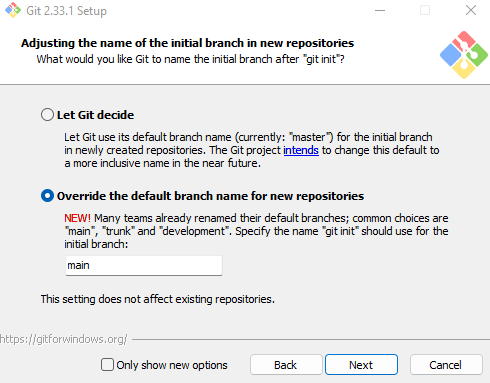

8. A tela seguinte permite configurar o uso dos comandos do Git. Escolha a opção que acha mais adequada para você e clique em Next.

    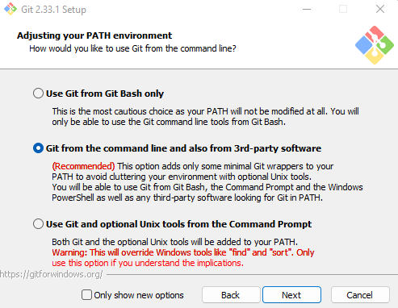

9. Em seguida, escolha qual cliente de SSH o Git deve utilizar e continue.

    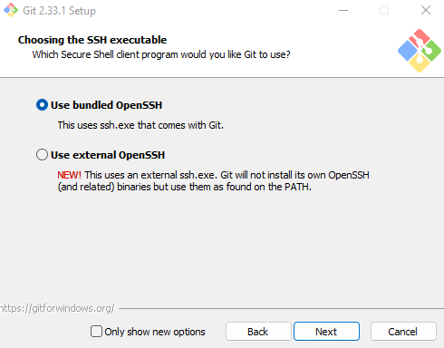

10. Na próxima tela, o instalador permite escolher qual biblioteca SSL/TLS o Git deve utilizar para conexões HTTPS. Escolha a melhor opção para você e continue.

    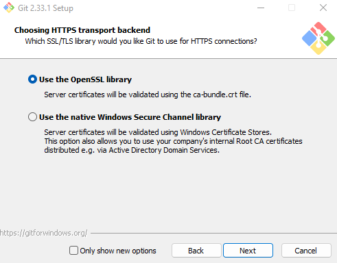

11. Em seguida, escolha a opção mais adequada de delimitador de linha para você clique em Next.

    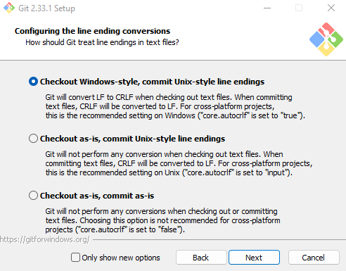

12. Decida qual emulador de terminal que você quer usar para o Git e continue.

    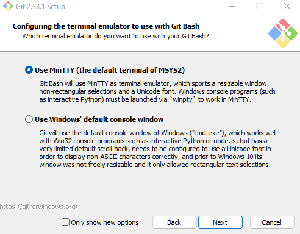

13. Escolha a opção que acha mais adequada para utilizar como comportamento padrão do `git pull` e clique em Next.

    

14. O instalador permite habilitar o uso do [Git Credential Manager Core](https://github.com/microsoft/Git-Credential-Manager-Core). Escolha se deseja utilizá-lo ou não e clique em Next.

    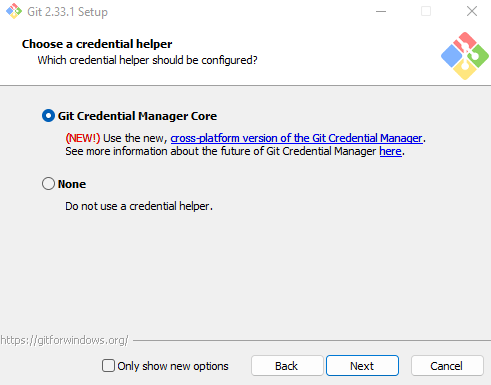

15. É possível habilitar alguns recursos extras. Escolha se deseja habilitá-los ou não e clique em Next.

    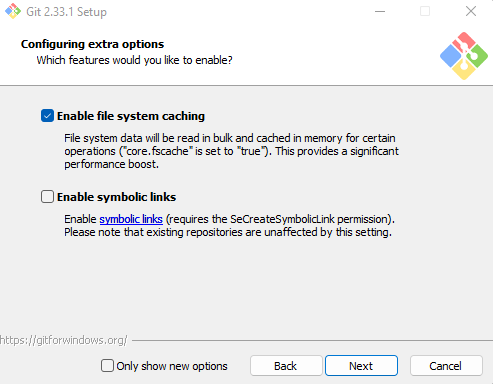

16. É possível também habilitar recursos experimentais. Escolha se deseja habilitá-los ou não e clique em Install.

    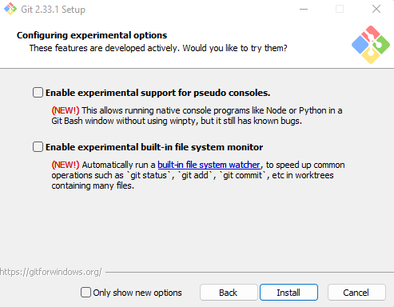

17. Finalmente, você pode escolher executar o prompt do Git e também pode ver as notas da versão lançada. Decida o que deseja habilitar e clique em Finish para completar a instalação.

    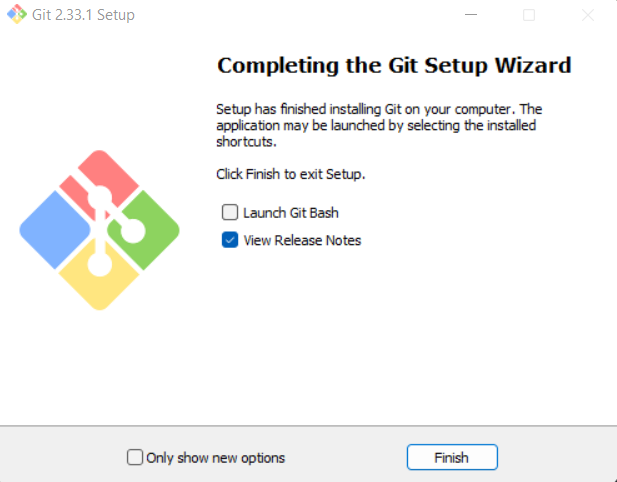

Depois de instalar só configurar com:
```bash
git config --global user.name "Nome Sobrenome"
git config --global user.email "exemplo@seuemail.com"
git config --global color.ui true
```

Para configurar o editor padrão de edição de mensagens do prompt do git, só consultar os editores existentes na tabela presente [nesta página](https://www.atlassian.com/br/git/tutorials/setting-up-a-repository/git-config).

## Faça uma conta no Github

- [Github Sign up](https://github.com/signup)

Inclusive, pra quem é estudante o Github oferece umas coisas bem legais, então faz o seu [cadastro aqui](https://education.github.com/pack), é só usar o e-mail da PUC.

Também é bom saber que existem outros hosts de versionamento remoto, como o Gitlab e o Bitbucket. Mas essas ferramentas são pagas, então é mais provável que você só vá ter contato com elas quando estiver estagiando/trabalhando.

## Dica pro fim de semana do pessoal

A publi aqui é gratuita, só porque eu curto mesmo...

- Assista [Maldição da Residência Hill](https://www.netflix.com/br/title/80189221) na Netflix
- Assista [Maldição da Mansão Bly](https://www.netflix.com/br/title/81237854) na Netflix
- Assista [Missa da Meia-Noite](https://www.netflix.com/br/title/81083626) na Netflix
- Assista [Critical Role](https://www.youtube.com/playlist?list=PL1tiwbzkOjQxD0jjAE7PsWoaCrs0EkBH2) no Youtube (esse aqui no caso precisa de mais do que de um fim de semana)
